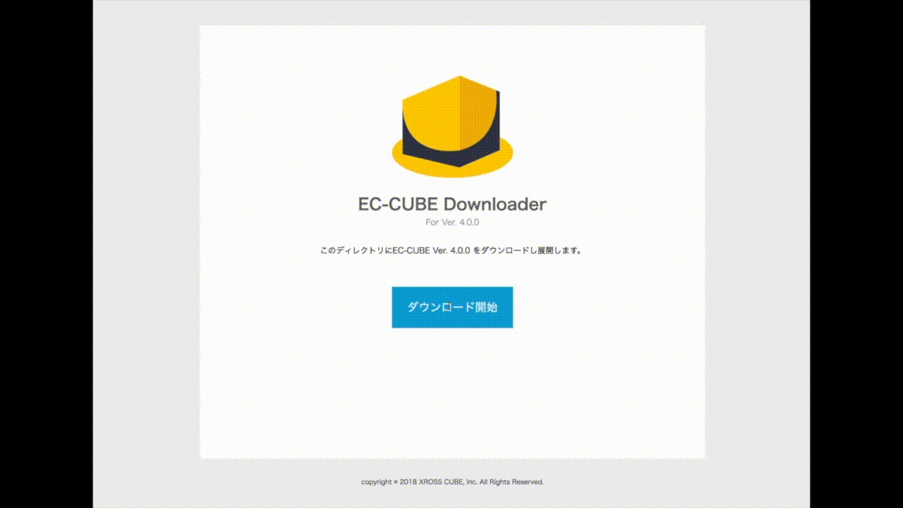

# EC-CUBE One-File Downloader

EC-CUBEの最新版をダウンロード、展開するスクリプトです。

EC-CUBEをインストールしたいディレクトリにdw.phpをアップロードし、ブラウザでアクセスしてください。
masterブランチはVer.4.x.x用です。3.x.x対応版を使いたい方は、[3.0ブランチ](https://github.com/tao-s/eccube-downloader/tree/3.0)を使ってください。

Download and deploy the latest version of EC-CUBE.
Upload "dw.php" to install directory in the web server.
Then, access to that PHP script on browser.

## 使えたレンタルサーバ

* [さくらのレンタルサーバ スタンダード](https://www.sakura.ne.jp/)
* [xServer](https://www.xserver.ne.jp/)

---

Copyright 2018 [XROSS CUBE, Inc.](https://www.xross-cube.com/)

This script is free to re-distribute as long as you keep this copyright notice.
Personal use is permitted.
However the copyrighter holds no responsibility against any damages caused by using this script.

コピーライト以外の改変、再配布OK。個人利用の範囲で自由に使ってOKです。ECサイト開発者の方やネットショップオーナーの方が業務で使うのもOK。
その代わり当方では一切責任を負いません。
